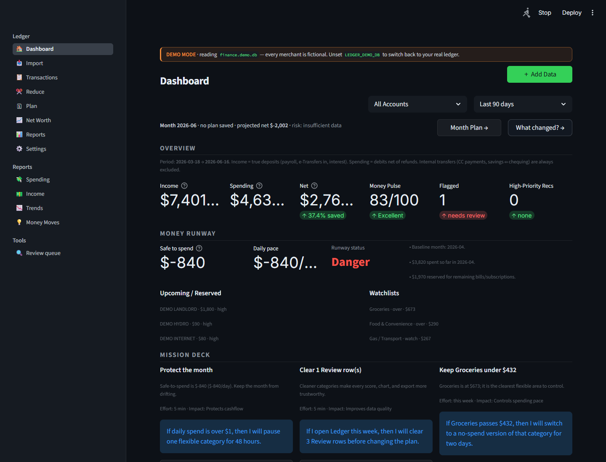
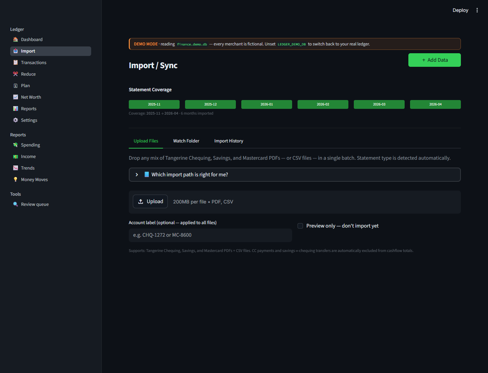
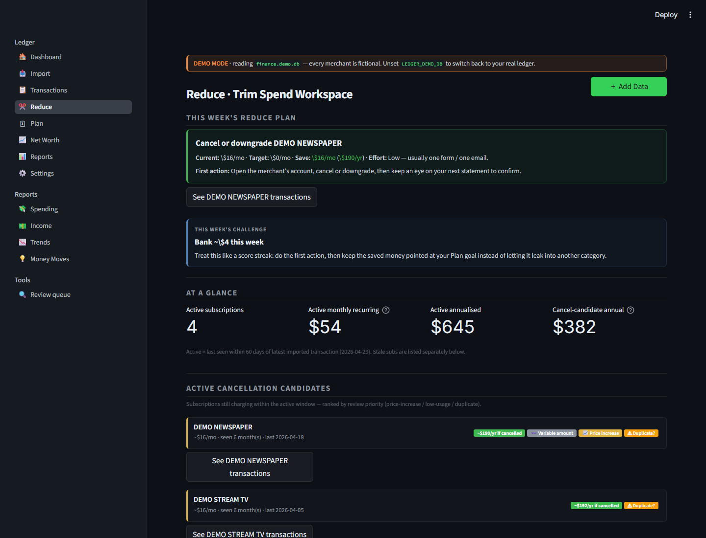
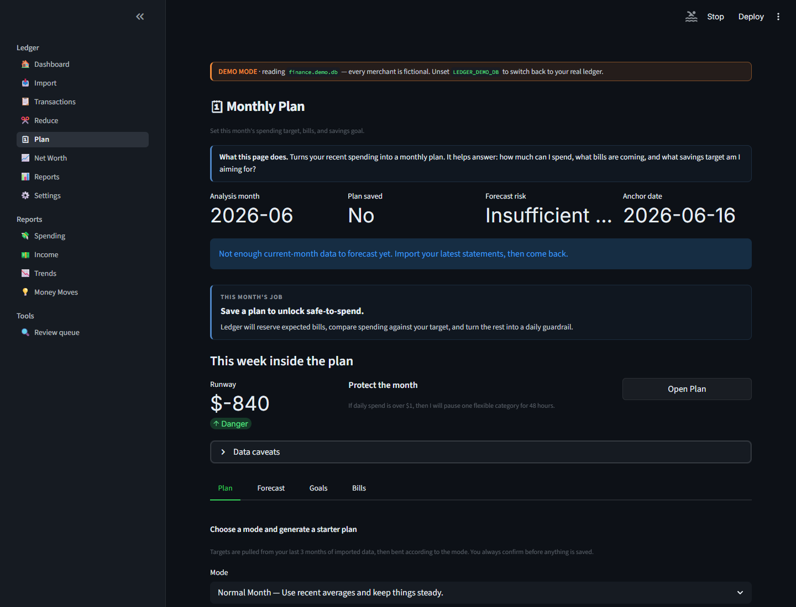
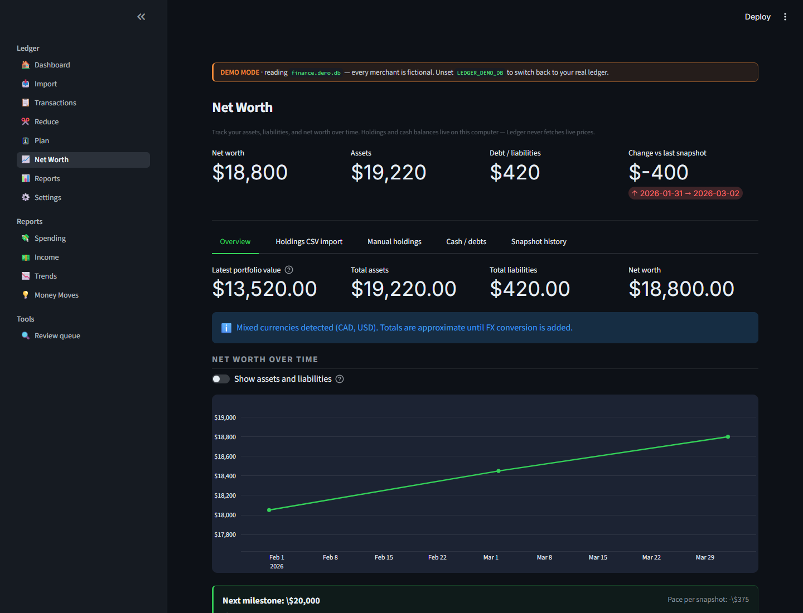
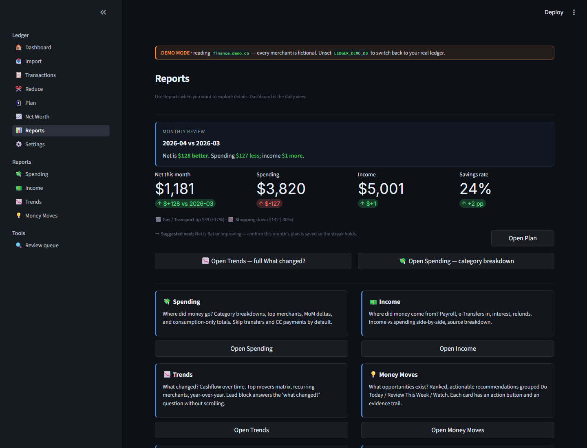

# Ledger

[](https://github.com/benthompsondev/ledger-local-finance/actions/workflows/ci.yml)
[](LICENSE)
[](requirements.txt)
[](SECURITY.md)

Open-source local-first personal finance app built with Python, Streamlit,
Plotly, and SQLite.

Ledger is my work-in-progress local finance app. The goal is to answer the weekly money questions that actually matter:

- Where am I financially right now?
- Am I better or worse than last month?
- What changed?
- How much can I safely spend?
- What should I cut first?
- Am I building savings, reducing waste, and improving net worth?

It runs on your own computer, stores data in a local SQLite database, and treats deterministic calculations as the source of truth. Optional AI features can explain the numbers, but AI does not edit financial data or invent figures.

> Privacy warning: Ledger is designed for local use. Do not deploy it publicly with real financial data. Streamlit is configured for localhost use, and share/export tools are built to exclude private database and config files.

Ledger is MIT licensed. I built it to be useful as a real local app, but it also works as a portfolio project for Python, Streamlit, SQLite, data import, privacy-safe local apps, and maintenance guardrails.

## Try It First

If you are just checking out the project, start with demo mode. It creates a fake local database, opens the app on your computer, and avoids mixing your own financial data into screenshots or tests.

```powershell
git clone https://github.com/benthompsondev/ledger-local-finance.git
cd ledger-local-finance
python -m venv .venv
.\.venv\Scripts\python.exe -m pip install -r requirements.txt
.\.venv\Scripts\python.exe -m scripts.create_demo_data
$env:LEDGER_DEMO_DB="1"
.\.venv\Scripts\python.exe -m streamlit run app.py
```

Open `http://127.0.0.1:8501`.

After that, turn demo mode off in a new terminal and use the Import page with your own PDFs or CSVs:

```powershell
Remove-Item Env:\LEDGER_DEMO_DB -ErrorAction SilentlyContinue
.\.venv\Scripts\python.exe -m streamlit run app.py
```

There is also a shorter first-time user guide in [`docs/GETTING_STARTED.md`](docs/GETTING_STARTED.md).

## Why I Built This

Most budgeting tools I tried were either too manual, too cloud-dependent, or too focused on charts instead of decisions. Ledger is my attempt at a practical local-first version: import statements, clean up transactions, understand what changed, make a month plan, reduce waste, and track progress.

It is also a portfolio project because it shows:

- Python application structure
- Streamlit UI development
- SQLite schema design and migrations
- PDF and CSV parsing
- deterministic finance calculations
- privacy-safe exports
- test runs and share-package safety checks
- optional AI integration with strict read-only guardrails
- GitHub Actions validation and contributor safety checks

## What It Does

### Import

- Tangerine Mastercard, Chequing, and Savings PDFs
- generic bank CSV files
- investment holdings CSV snapshots
- import history with statement periods and removable batches
- duplicate detection by file hash and transaction hash

### Dashboard

- income, spending, net, and savings rate
- Money Pulse score based on complete statement months
- Money Runway safe-to-spend number after bills, subscriptions, goals, fees, and a buffer
- Mission Deck with three practical weekly actions
- Tiny Wins that make small savings opportunities visible without moving money automatically
- top spending categories and merchants
- statement-aware score explanations
- optional local-data-grounded copilot summary
- quick routes to Plan, Trends, Reduce, and Review

### Money Pulse

Money Pulse is a 0-100 monthly score. It is not a credit score and not financial advice. It is a practical control score built from local transaction data:

| Dimension | Default Weight | What It Measures |
|---|---:|---|
| Savings | 40 | Net cashflow / savings rate for the latest complete statement month |
| Spending control | 30 | Controllable category concentration and trend vs the prior complete month |
| Debt & fees | 15 | Exact statement interest and fees only |
| Consistency | 15 | Recent complete months with positive net cashflow |

Mortgage, utilities, insurance, transfers, credit-card payments, and finance charges are excluded from Spending control because they should not be treated like everyday discretionary categories.

Debt & fees uses bank-provided statement summary fields when available. If a Mastercard summary is missing, Ledger does not guess from transaction rows.

### Reduce

Reduce is the action workspace. It turns spending data into practical cut targets:

- weekly trim-spend challenge
- active subscription candidates
- controllable category targets
- first-action suggestions
- inactive recurring services separated from active savings opportunities
- quick links into filtered transaction history

The idea is to watch the few categories that matter instead of trying to micromanage everything.

### Plan

The Plan page turns recent spending into a monthly operating plan:

- mode-based starter plans
- weekly runway callout connected back to the Dashboard mission deck
- income, spending, and savings targets
- safe-to-spend after reserved bills
- forecast risk
- category targets
- bills and recurring commitments
- goals and net-worth progress

The planning model uses the useful parts of zero-based budgeting: give the month a job, reserve true expenses, and make tradeoffs visible.

### Reports

Reports is the deeper analytics hub:

- Spending
- Income
- Trends
- Money Moves
- Monthly Review
- details on what changed and why

Dashboard stays practical. Reports is where the deeper inspection lives.

### Net Worth

- cash and debt balance snapshots
- investment holdings CSV imports
- net-worth history
- goal progress
- mixed-currency warnings

Ledger does not fetch market prices from the internet.

### Optional AI

Ledger works without AI. If configured, AI can summarize, explain, and coach using local evidence packets.

Guardrails:

- AI cannot mutate the database
- AI cannot create transactions, budgets, goals, or recommendations by itself
- AI outputs must be grounded in deterministic local data
- Money Runway, Mission Deck, Found Money, and Money Pulse are deterministic packets first
- API keys stay in `config.json`, which is excluded from share zips and git
- OpenClaw exports are read-only unless future proposal files are explicitly reviewed

## Screenshots

These screenshots use generated demo data only. Real financial data should never be committed.

| Dashboard | Import |
|---|---|
|  |  |

| Reduce | Plan |
|---|---|
|  |  |

| Net Worth | Reports |
|---|---|
|  |  |

## Quick Start

### Windows

Use the launcher:

```powershell
python Ledger_Launcher.py
```

Or run the PowerShell helper:

```powershell
.\run_windows.ps1
```

The launcher creates a local virtual environment, installs dependencies, and starts Streamlit on `127.0.0.1`.

### Manual Run

```powershell
python -m venv .venv
.\.venv\Scripts\python.exe -m pip install -r requirements.txt
.\.venv\Scripts\python.exe -m streamlit run app.py
```

Open:

```text
http://127.0.0.1:8501
```

## Demo Mode

Use synthetic data for screenshots, demos, and portfolio review:

```powershell
.\.venv\Scripts\python.exe -m scripts.create_demo_data
$env:LEDGER_DEMO_DB="1"
.\.venv\Scripts\python.exe -m streamlit run app.py
```

Never use real financial screenshots in a public portfolio.

## Using Your Own Data

Ledger stores your data locally in `data/finance.db`. That file is ignored by git.

The Import page supports:

- Tangerine Mastercard PDFs
- Tangerine Chequing and Savings PDFs
- generic transaction CSV files
- holdings CSV snapshots for net worth tracking

The app checks duplicate files and duplicate transactions, then lets you review the results. For a public demo, use demo mode. For real use, keep the project folder private and never upload `data/`, `config.json`, statement PDFs, exports, or screenshots with real accounts.

## Verification

Run these from the project virtual environment:

```powershell
$env:PYTHONIOENCODING="utf-8"
.\.venv\Scripts\python.exe -m compileall -q app.py pages utils parsers scripts components
.\.venv\Scripts\python.exe -m scripts.smoke_test
.\.venv\Scripts\python.exe -m scripts.export_agent_context
.\.venv\Scripts\python.exe -m scripts.make_share_zip
```

The smoke test covers parser imports, database initialization, net-worth math, holdings CSV parsing, planning/forecast shapes, agent-context safety, demo-data safety, statement-summary scoring, review-queue cleanup, and share-zip exclusions.

## Contributing And Maintainer Workflow

Ledger is open source under the MIT license. Contributions should preserve the
local-first privacy model and the deterministic finance truth layer.

Start with:

- `CONTRIBUTING.md` for setup, validation, and pull-request expectations
- `SECURITY.md` for privacy and secret-handling rules
- `AGENTS.md` for AI-agent coding rules
- `docs/MAINTAINER_WORKFLOW.md` for the maintenance workflow
- `docs/MAINTENANCE_GUARDRAILS.md` for the maintenance and privacy story behind this repo

Codex and other AI coding tools can help inspect, test, document, and implement
changes, but human review remains responsible for financial logic, privacy, and
publishing.

## Privacy And Share Safety

Do not manually zip or share the project folder. Use:

```powershell
.\.venv\Scripts\python.exe -m scripts.make_share_zip
```

The share script excludes:

- `.venv/`
- `data/`
- `exports/`
- `dist/`
- `.claude/`
- `config.json`
- `finance.db`
- `finance.demo.db`
- `launcher.log*`
- `CLAUDE_HANDOFF.md`
- `__pycache__/`

It also scans included text files for common secret patterns.

## Project Structure

```text
app.py                     Streamlit router
pages/                     Streamlit pages
components/                reusable Plotly chart builders
parsers/                   Tangerine PDF, generic CSV, holdings CSV parsing
utils/database.py          SQLite schema and persistence helpers
utils/analytics.py         cashflow, spending, Money Pulse score
utils/planner.py           plan, forecast, safe-to-spend, goals, bills
utils/insights.py          recommendations, subscriptions, monthly review
utils/agent_context.py     read-only OpenClaw export context
scripts/smoke_test.py      regression/safety smoke suite
scripts/make_share_zip.py  privacy-safe share artifact builder
scripts/export_agent_context.py
openclaw/                  read-only finance-agent prompt/contracts
```

## Technical Notes

- Local SQLite is the truth layer.
- Statement summaries are preferred over transaction guesses for Mastercard interest and fees.
- Partial months remain visible but are excluded from monthly truth comparisons until complete.
- Internal transfers and credit-card payments are excluded from spending totals.
- AI can explain deterministic data but cannot mutate financial records.
- Share artifacts are privacy-checked before distribution.

## What I Would Add Next

Near-term improvements:

- polished demo screenshots
- GitHub Actions validation on push
- friend-safe onboarding flow
- stronger Plan page interaction
- richer Reduce watchlists and weekly challenges
- better recurring charge confirmation workflow
- optional local-only backup/export wizard

Longer-term ideas:

- mobile-friendly layout
- encrypted backup
- explicit proposal-review workflow for external agents
- multi-bank parser packs
- cloud/web version with auth, encryption, export/delete-account flows, and privacy policy

## License

MIT. See `LICENSE`.
