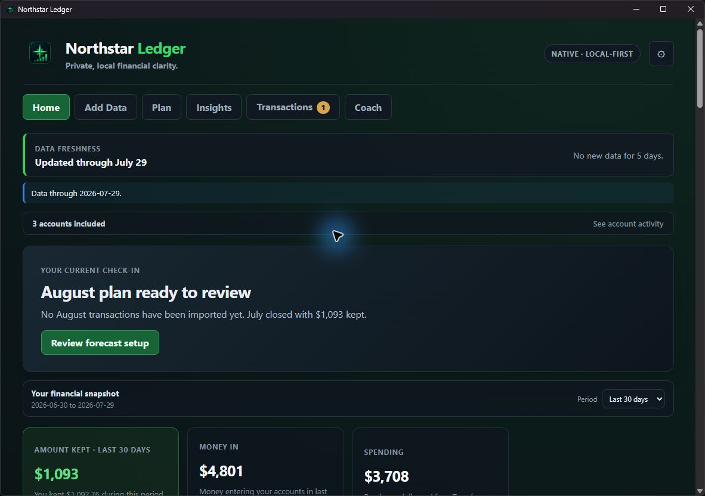

# Northstar Ledger

[](https://github.com/benthompsondev/ledger-local-finance/actions/workflows/ci.yml)
[](https://github.com/benthompsondev/ledger-local-finance/releases/latest)
[](LICENSE)
[](SECURITY.md)

A local-first personal finance app for Windows. Import your bank statements,
clean up the transactions, see where the money actually went, and plan the
month. Everything stays on your machine: no account, no sign-in, no server, no
network calls for the finance math.

I built it because the budgeting tools I tried were either too manual, too
cloud-dependent, or too busy drawing charts to answer the question I actually
had, which was some version of "am I okay, and what changed."

**[Take the product tour](https://benthompsondev.github.io/ledger-local-finance/)** - current native screens with synthetic data ·
**[Download the installer](https://github.com/benthompsondev/ledger-local-finance/releases/latest)** - one .exe, no Python needed ·
**[Read the setup guide](docs/GETTING_STARTED.md)**



The questions it is built to answer:

- Where am I right now?
- How much can I safely spend?
- What changed since last month?
- What is coming that I have not set money aside for?
- Am I actually making progress?

## Install it

Download the installer from the
[latest release](https://github.com/benthompsondev/ledger-local-finance/releases/latest)
and run it. That is the whole thing. You do not need Python, Node or Rust to
use Northstar; the installer bundles everything, including the Python engine.

```
NorthstarLedger_2.8.0_x64-setup.exe
```

It installs for your user only, so no admin prompt. Installing over an older
version keeps your data.

**Windows will warn you the first time.** The installer is not Authenticode
signed, so SmartScreen may show "Windows protected your PC". Click More info,
then Run anyway. The release page includes a SHA-256 checksum if you want to
verify the download.

### Updating

From 2.6.0 onward, **Settings → App updates** checks GitHub when you press the
button and installs a new version only if its updater signature matches.
Nothing is checked in the background and nothing about you is sent.

If you are on 2.5.5 or older there is no updater in that build, so install the
latest release by hand this once.

## Status

**Current release: 2.8.0. Windows public beta.** It works, it is tested, and it
is still a beta. This release is about Insights finding things you would not
go looking for. It reads your finished months as a run instead of one at a
time, so it can tell you when a category has moved to a new level, when what
you keep each month has changed, and what made the last finished month
different from the one before. Every observation shows the figures behind it
and takes you to the transactions that back it up.

- **Your own statements remain the source of truth.** The math is covered by
  tests, but check anything that matters against your bank.
- Everything stays on your machine. The two exceptions both need you to act
  first: the optional AI feature (see [Optional AI](#optional-ai-beta)) and an
  update check you clicked.

The [browser product tour](https://benthompsondev.github.io/ledger-local-finance/)
shows the interface with generated data. It is deliberately a tour, not a
browser copy of the finance engine.

## What it is

The shipping product is a native Windows desktop application: a Tauri 2 shell
written in Rust, wrapping a React and TypeScript interface, talking to a
packaged Python engine over stdin and stdout. Your data lives in a SQLite
database at `%LOCALAPPDATA%\Ledger\finance.db`.

It never opens a browser and never exposes a localhost service.

There are six tabs:

| Tab | What it is for |
|---|---|
| **Home** | The weekly check-in. Safe to Spend, what changed, and the few things worth looking at. |
| **Add Data** | Import statements. Detects the file's shape once, shows you what it found, and refuses files whose evidence is contradictory. |
| **Plan** | Turn recent spending into a monthly plan, then compare a finished month with the exact plan that existed for it. |
| **Insights** | What Northstar noticed in your history, with the figures and the transactions behind it. Also spending pace, category movement, income steadiness, cashflow and monthly net worth. |
| **Transactions** | The full ledger. Search, filter, recategorize, exclude transfers, fix mistakes. |
| **Coach** | Optional AI explanation of numbers the engine already computed. Works only if you configure a provider. |

**Settings** is the gear in the header rather than a tab. It holds backup and
restore, preferences, categorization controls, data-safety tools, planning
balances, app updates and the optional AI configuration. Demo mode uses the
environment-variable flow described below rather than an in-app switch.

There is no Goals tab. The old goal rows are kept in the local database, but
they no longer reserve money or appear in the native app.

## Design rules

These are the rules the code is held to, and they are the reason some numbers
look more cautious than other apps:

- **The math is the product.** A number is never shown more confidently than
  the data supports. If an input is missing, the number degrades and says so
  rather than hiding behind a gate or quietly guessing.
- **Import fails closed.** A statement has one date format, one decimal
  convention, one column layout. Those are detected once per file and shown to
  you. A file with contradictory evidence is refused. Silently importing wrong
  dates or hundredfold amounts is the worst thing this app could do.
- **One canonical number per concept.** There is exactly one Safe to Spend, and
  every screen reads it. When a second copy of a rule shows up, it gets deleted.
- **Comparisons span equal periods.** A partial month is never measured against
  a full one, and when the previous month ended earlier than today the app says
  so instead of pretending the comparison is same-day.

## Building it from source

**You do not need any of this to use Northstar.** Skip to
[Importing your own statements](#importing-your-own-statements) unless you want
to work on the code.

You need [Rust](https://rustup.rs/), [Node 24+](https://nodejs.org/), and
[Python 3.13+](https://www.python.org/downloads/). CI uses Node 24 and Python
3.14, which is also the interpreter bundled with the installer.

```powershell
git clone https://github.com/benthompsondev/ledger-local-finance.git
cd ledger-local-finance
python -m venv .venv
.\.venv\Scripts\python.exe -m pip install -r requirements.txt
npm ci
npm run desktop:dev
```

That runs the app in development mode with hot reload.

To build the Windows installer:

```powershell
powershell -File scripts/build_native_desktop.ps1
```

The installer lands in `src-tauri/target/release/bundle/nsis/`.

### Try it with demo data first

Demo mode is not a switch inside the app. It is two environment variables, so
the app can never quietly point itself at generated data or at yours:

```powershell
$demoDir = Join-Path $env:TEMP "northstar-ledger-demo"
New-Item -ItemType Directory -Force -Path $demoDir | Out-Null
.\.venv\Scripts\python.exe -m scripts.create_demo_data --out "$demoDir\finance.demo.db" --force
$env:LEDGER_DATA_DIR = $demoDir
$env:LEDGER_DEMO_DB = "1"
npm run desktop:dev
```

Everything runs out of that temp folder, so your real database is never opened.
Clear both variables to go back to it:

```powershell
Remove-Item Env:LEDGER_DATA_DIR, Env:LEDGER_DEMO_DB
```

## Importing your own statements

Add Data handles:

- bank and credit card CSV exports
- Tangerine Mastercard, Chequing and Savings PDFs
- investment holdings CSV snapshots

Every import is logged as a batch with its statement period, and batches can be
removed. Duplicates are caught by file hash and by transaction fingerprint, so
re-importing the same file does nothing rather than doubling your spending.

If a file's shape cannot be determined confidently, the import stops and tells
you what was ambiguous instead of guessing.

## Optional AI (Beta)

The app works completely without AI, and nothing in the finance math depends on
it. Every figure on every screen is computed locally whether AI is on or off,
and Coach still reports its deterministic findings with AI disabled.

This part is marked **Beta** because provider compatibility varies. Northstar
speaks the OpenAI chat format and Anthropic's Messages API, but a provider that
claims compatibility can still differ enough to return an error. If you
configure a provider key, AI can summarize and explain numbers the local engine
already calculated.

**Be clear about what leaves your machine.** With an online provider enabled,
the evidence packet for the question you asked is sent to that provider. That
packet contains real figures from your ledger: totals, category names, merchant
names and dates, depending on the feature. Your database file never leaves the
machine, but the contents of a request do. If that is not a trade you want,
leave AI off and everything still works.

The useful boundaries are simple:

- AI cannot write to the database. It cannot create or edit transactions,
  budgets, goals or plans.
- Safe to Spend, the plan equation and the insight feed are calculated locally
  before anything is handed over for explanation.
- Only the packet for the feature you invoked is sent. There is no background
  syncing and no telemetry.
- Provider keys are encrypted with Windows DPAPI and tied to your Windows user.
- Turning AI off, or never configuring it, changes none of the numbers.

## Privacy

The finance math is entirely local and deterministic. There is no telemetry,
no analytics and no account. Northstar makes exactly two kinds of outbound
request, and you have to start both:

- An **AI request** you triggered, to a provider you configured, carrying the
  evidence packet described above.
- An **update check** you clicked, to this repository's releases on GitHub. It
  asks for the latest version number and sends nothing else: no identifier, no
  usage data, nothing from your ledger. It never runs on its own.

For contributors, the repository includes a few practical guardrails:

- `scripts/check_tracked_files.py` refuses any tracked path that looks like a
  database, statement, export, log, or secret, and runs in CI on every push.
- `scripts/doctor.py` runs the same check locally.
Never commit real statements, exports, screenshots containing real data, or the
database. Demo data exists so you never have to.

## Development

```bash
.venv/Scripts/python.exe -m pytest -q      # the real test suite
npm run build                              # tsc -b + vite build
npm run test:charts                        # chart and preference tests
cd src-tauri && cargo check && cargo test  # the native shell
```

CI runs all of these on every push, plus `npm audit --omit=dev` and the tracked
file guard.

Tests use disposable data only, through the `ledger_db` fixture or by pointing
`LEDGER_DATA_DIR` at a temp directory. Nothing in the suite touches the real
database.

Architecture, conventions and the rules agents follow are in
[AGENTS.md](AGENTS.md). Contributor setup is in
[CONTRIBUTING.md](CONTRIBUTING.md).

## Project structure

```
desktop/src/            React interface. One view per screen.
                        types.ts is the contract with the engine.
                        charts.tsx holds every chart.
desktop/engine/         The Python sidecar. One *_action per request.
src-tauri/              The Tauri shell and its commands.
utils/                  The finance engine.
                          financial_semantics.py  amount, direction, type
                          checkin.py              safe_to_spend_summary
                          insights.py             aggregates, pace, runway
                          planner.py              commitments and readiness
                          analysis_period.py      how far the data reaches
                          database.py             schema and migrations
parsers/                Statement import.
                          csv_dialect.py  decides a file's shape once
                          csv_import.py   applies it
tests/                  Engine-level tests asserting real financial outcomes.
scripts/                Build, demo data, diagnostics, privacy guards.
```

The older Streamlit files still in the repository are retired. Everything in
this README refers to the native desktop application.

## License

MIT. See [LICENSE](LICENSE).
