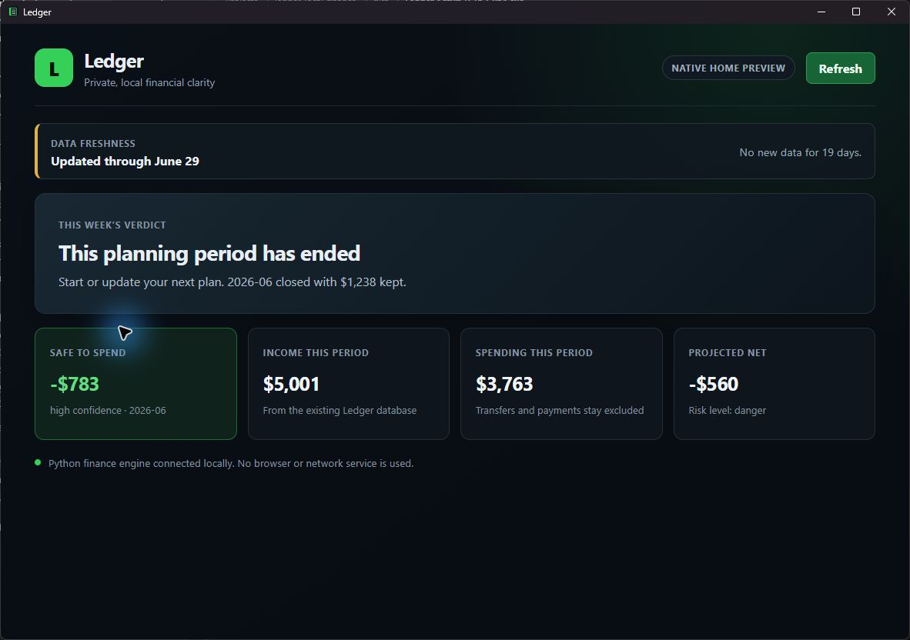

# Ledger native desktop 0.36.1 validation

## Status

The first native Home vertical slice passed local Windows installer validation
on July 18, 2026. This is an installable architecture proof, not approval to
migrate another page.

A clean Windows VM was not available on this host. The result must not be
described as clean-machine validated. The installed build was, however, run
with a restricted `PATH` that excluded the project virtual environment and the
user Python installation, and it spawned no `python.exe` or `pythonw.exe`
process.

## CloakScan comparison

The expected CloakScan checkout was not present at its usual location. The
available local checkout was found and inspected before implementation.

| Area | CloakScan convention | Ledger slice |
| --- | --- | --- |
| Window | Tauri 2 with a React/TypeScript frontend | Same |
| Native layer | Small Rust shell with narrow Tauri commands | Same, with one `get_home_summary` command |
| Permissions | Minimal capabilities and generated command ACLs | Same; no filesystem, HTTP, opener, or general shell permission is exposed to the frontend |
| Windows package | Current-user Tauri NSIS bundle with offline WebView2 | Same |
| Application engine | Rust-owned application logic | Existing Python finance engine retained as a packaged sidecar |
| Process bridge | Tauri IPC | Tauri IPC to Rust, then one JSON request and response over sidecar stdin/stdout |
| User data | Per-user application data outside program files | `%LOCALAPPDATA%\Ledger`, separated from `%LOCALAPPDATA%\Programs\Ledger` |
| Release automation | Windows packaging and release workflow | Inspected but not copied because this slice is local-only and must not be published |

Ledger keeps `utils.database`, schema migrations, backup behavior, and
`utils.checkin.weekly_checkin()` unchanged. Streamlit remains available only as
the legacy interface and rollback path. PyInstaller packages the Python engine,
not the desktop UI.

## Artifact

```text
src-tauri\target\release\bundle\nsis\Ledger_0.36.1_x64-setup.exe
```

- Size: `217,896,302 bytes` (about 207.8 MiB)
- SHA-256: `7DDC00C73496F22349AAB365234CC8AD8E897B43444F9B630938D34C32C71144`
- Authenticode: not signed
- Install scope: current user
- Program files: `%LOCALAPPDATA%\Programs\Ledger`
- Financial data: `%LOCALAPPDATA%\Ledger`

The large installer includes Tauri's offline WebView2 bootstrap payload so the
installer does not depend on downloading WebView2 during setup.

## Exact-installer checks

All UI checks used `data\finance.demo.db` or a copied synthetic database. No
real financial values were captured in the screenshot or test output.

| Requirement | Result |
| --- | --- |
| Silent installer completes | Pass, exit code 0 |
| Windows Installed Apps entry | Pass, one `Ledger` entry under the current user |
| Start Menu application | Pass; shortcut targets `%LOCALAPPDATA%\Programs\Ledger\ledger-native.exe` |
| Dedicated window | Pass; visible window title was `Ledger` |
| External browser | Pass; zero new Chrome, Edge, Firefox, Brave, or Opera processes |
| Visible localhost/server | Pass; no URL is shown and the Ledger process owned zero TCP listeners |
| Packaged engine path | Pass; Home returned a successful JSON result from the installed sidecar |
| Path containing spaces | Pass for the repository, installed path, and isolated data root |
| No development virtual environment | Pass with `PATH=C:\Windows\System32;C:\Windows` |
| No user Python process | Pass; zero `python.exe` and `pythonw.exe` processes |
| No console window | Pass by build configuration and observed UI; the release Tauri app uses the Windows GUI subsystem and the console-enabled sidecar bootloader uses PyInstaller `--hide-console hide-early` |
| Sidecar lifecycle | Pass; zero `ledger-engine` processes after Home loaded and after application close |
| Data placement | Pass; the test database and native log stayed in the selected Ledger data root |
| Uninstall data safety | Pass; program files and shortcut were removed while the existing private database hash remained unchanged |
| Reinstall | Pass; exact final installer restored the app and Start Menu shortcut |

The CSP contains Tauri's internal WebView IPC origin, but the packaged
application does not run an HTTP server or bind a localhost TCP port.

## Automated checks

- Python: `139 passed in 6.39s`
- Rust: `2 passed`
- TypeScript/Vite production build: pass
- `cargo fmt --check`: pass
- `cargo clippy -- -D warnings`: pass
- `python -m compileall`: pass
- Ledger doctor: pass
- Ledger smoke suite: `ALL SMOKE CHECKS PASSED`
- `npm audit --audit-level=high`: 0 vulnerabilities
- Direct packaged-sidecar stdin/stdout check: pass

## Screenshot

The screenshot uses Ledger's synthetic demo database:



## Remaining limitations

- Only Home is native. Add Data, Transactions, Plan, Goals, Settings, Reports,
  and Trends were intentionally not migrated.
- No clean Windows VM was available, so a truly Python-free machine remains a
  release gate.
- The installer and executables are unsigned, so Windows may show a SmartScreen
  warning.
- The offline WebView2 payload makes the installer about 207.8 MiB.
- Version `0.36.1` is also used by the legacy prototype. Uninstall an existing
  0.36.1 preview before reinstalling this same-version native slice.
- The UI is deliberately functional rather than final visual polish.

## Rollback

1. Close Ledger.
2. Uninstall `Ledger` from Windows Installed Apps, or run:

   ```powershell
   & "$env:LOCALAPPDATA\Programs\Ledger\uninstall.exe"
   ```

3. Confirm `%LOCALAPPDATA%\Ledger\finance.db` still exists. Do not delete the
   `%LOCALAPPDATA%\Ledger` folder.
4. Revert the local native-slice commit:

   ```powershell
   git revert <native-slice-commit>
   ```

5. Continue using the existing Streamlit launcher against the preserved
   database. The legacy source was not removed.

The proposed next-page order is recorded in
[`docs/NATIVE_DESKTOP_SLICE.md`](../NATIVE_DESKTOP_SLICE.md). Do not start it
until this installed Home slice is accepted.
