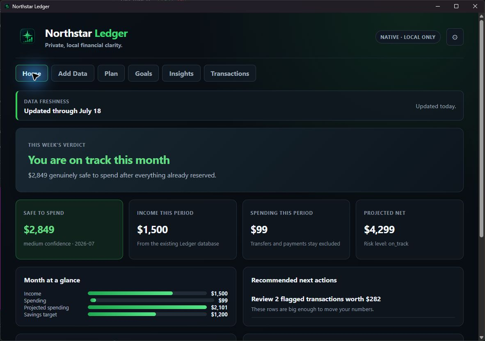

# Northstar Ledger native desktop 0.38.0 validation

## Status

Northstar Ledger 0.38.0 passed local Windows release-candidate acceptance on
July 18, 2026. The exact installer was built, installed, launched, and driven
with synthetic data through the core native weekly workflow.

This is not final public-release approval. No clean Windows VM or usable
Authenticode certificate was available on this host. The installer is
therefore unsigned and has not been clean-machine validated.

## Artifact

```text
src-tauri\target\release\bundle\nsis\NorthstarLedger_0.38.0_x64-setup.exe
```

- Size: `270,721,018 bytes` (about 258.2 MiB)
- SHA-256: `B715541D17BEBC6550025E9147E64F5958BFE59E5B4B5CEF6F4310C39561AC02`
- Authenticode: `NotSigned`
- Install scope: current user
- Program files: `%LOCALAPPDATA%\Programs\Ledger`
- Private data: `%LOCALAPPDATA%\Ledger`
- Visible product: `Northstar Ledger`
- Stable compatibility identifier: `dev.benthompson.ledger`

The installer includes Tauri's offline WebView2 payload. That increases the
size but avoids a WebView download during installation.

## Exact-installer acceptance

All financial values came from disposable synthetic databases under the
ignored `build\` directory. No private database, statement, log, credential,
or API key was bundled or captured.

| Requirement | Result |
| --- | --- |
| Install and upgrade | Pass; silent install returned 0 and the prior visible `Ledger` registration/shortcuts were removed |
| Installed Apps | Pass; exactly one `Northstar Ledger` 0.38.0 entry |
| Start Menu and desktop shortcuts | Pass; both target `%LOCALAPPDATA%\Programs\Ledger\ledger-native.exe` |
| Branding and executable metadata | Pass; Northstar title, icon, tagline, ProductName, and 0.38.0 version observed |
| Fresh first run | Pass; `No data imported yet`, unavailable Safe to Spend, and direct Add Data action |
| Native file picker | Pass; selected a CSV whose absolute path and filename contain spaces |
| Import preview | Pass; showed 3 new rows, 0 known duplicates, 2026-07-02 to 2026-07-05, $1,500 income, $86.60 spending, samples, and destination account |
| Import confirmation | Pass; 3 inserted and 2 routed for review |
| Duplicate protection | Pass; repeat preview showed 0 new and 3 known duplicates; engine confirmation skipped all 3 |
| Manual transaction | Pass through the installed UI |
| Transactions | Pass; 410-row paginated data, search, filters, detail, note/category correction, and edited provenance observed |
| Home refresh | Pass after import and correction without restart |
| Plan | Pass; saved a 2026-07 plan with fixed, flexible, savings, buffer, stance, and Safe to Spend evidence |
| Goals | Pass; linked-account goals suppress manual contribution; a manual goal contribution increased progress from $420 to $470 |
| Insights | Pass; trends, category bars, merchants, findings, $19,220 assets, $420 liabilities, and $18,800 net worth rendered |
| Backup | Pass through Settings; validated 440 KiB SQLite backup listed |
| Restore | Pass through the installed packaged engine; a post-backup sentinel write disappeared after restore |
| Close/relaunch persistence | Pass for empty and populated synthetic roots |
| Window sizes | Pass at the 900 x 620 minimum, normal size, and maximized |
| Second instance | Observed; a second launch currently opens a second native process/window |
| Browser/server/console | Pass; no browser opened, no Ledger-owned TCP connection/listener, and no console/Python child was visible |
| Uninstall | Pass; zero files and no install directory remained |
| Data-preserving reinstall | Pass; `%LOCALAPPDATA%\Ledger` survived uninstall and the exact installer reinstalled successfully |
| Legacy sidecar cleanup | Pass; obsolete root `ledger-engine.exe` removed; only `engine\ledger-engine.exe` remains |

## Automated checks

- Python: `150 passed in 8.55s`
- Native engine contract: `17 passed`
- Rust: `3 passed`
- `python -m compileall`: pass
- `cargo fmt --check`: pass
- `cargo clippy --all-targets -- -D warnings`: pass
- TypeScript/Vite production build: pass
- `npm audit --audit-level=high`: 0 vulnerabilities
- Ledger doctor: pass
- Release-safe share bundle: 263 files, secret scan passed, private data classes excluded

## Product scope

The primary native navigation is Home, Add Data, Plan, Goals, Insights, and
Transactions. Settings is a secondary destination. Existing Python parsers,
categorization, planning, forecasts, goals, analytics, balances, imports, and
backup/restore remain the source of financial truth. React contains display
logic only; there is no HTTP API or localhost server.

The Streamlit app remains a development/reference and rollback surface for
custom CSV mapping, grouped review/undo, and other workflows not yet moved.

## Screenshot



## Release blockers and known limitations

- The installer and executables are unsigned. No Current User or Local Machine
  code-signing certificate is installed, so Windows may show SmartScreen.
- A clean Windows VM was unavailable. Python-free clean-machine acceptance is
  still required before public release.
- A second launch opens another app window. Add single-instance focus handling
  before calling the desktop product final.
- CSV files that need a custom column map must still be mapped once in the
  Streamlit reference app; native imports reuse saved profiles.
- Grouped review and import undo are not yet exposed in the native UI.
- The watch-folder importer and optional AI explanations remain deferred.

## Private acceptance steps

1. Verify the SHA-256 above with `Get-FileHash`.
2. Install the exact artifact and launch `Northstar Ledger` from Start.
3. Confirm `%LOCALAPPDATA%\Ledger` is your expected existing data location in
   Settings before importing anything.
4. Create a backup in Settings.
5. Preview one copied statement, confirm its account and totals, then import.
6. Review Home, Plan, Goals, Insights, and one transaction correction.
7. Keep the existing Streamlit launcher available as rollback until signing
   and clean-VM acceptance are complete.

## Rollback

Uninstall Northstar Ledger from Installed Apps or run
`& "$env:LOCALAPPDATA\Programs\Ledger\uninstall.exe"`. Do not delete
`%LOCALAPPDATA%\Ledger`. The legacy Streamlit launcher can continue against the
preserved database.
